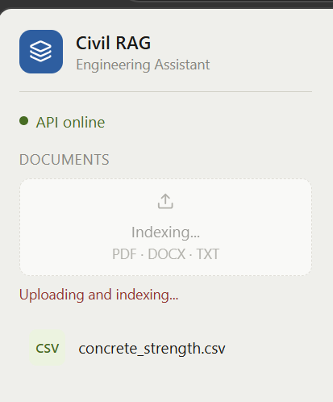
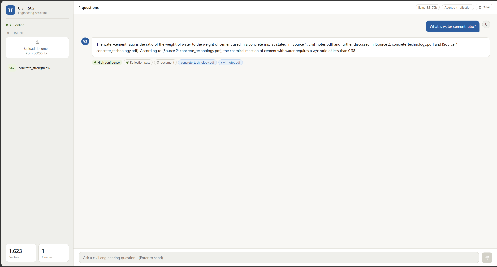
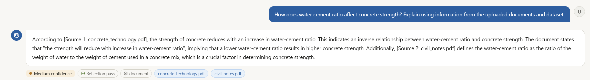
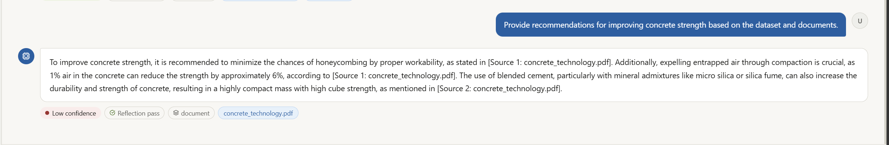

# CIVIL-RAG-MODEL

AI-powered Civil Engineering Assistant built using Retrieval-Augmented Generation (RAG), FAISS Vector Search, Sentence Transformers, FastAPI, React, and Groq LLMs.

## Features

- PDF/DOCX/TXT Document Upload
- Semantic Search with FAISS
- Retrieval-Augmented Generation (RAG)
- Query Expansion
- Reranking Pipeline
- Dataset Analysis
- Source Attribution
- Confidence Scoring
- React Frontend + FastAPI Backend

## Tech Stack

- Python
- FastAPI
- React.js
- FAISS
- Sentence Transformers
- Groq API
- Pandas
- NumPy

## Screenshots

### Home Page

### Document Upload & Indexing

### AI Question Answering

### Advanced RAG Query

### Recommendation Generation
